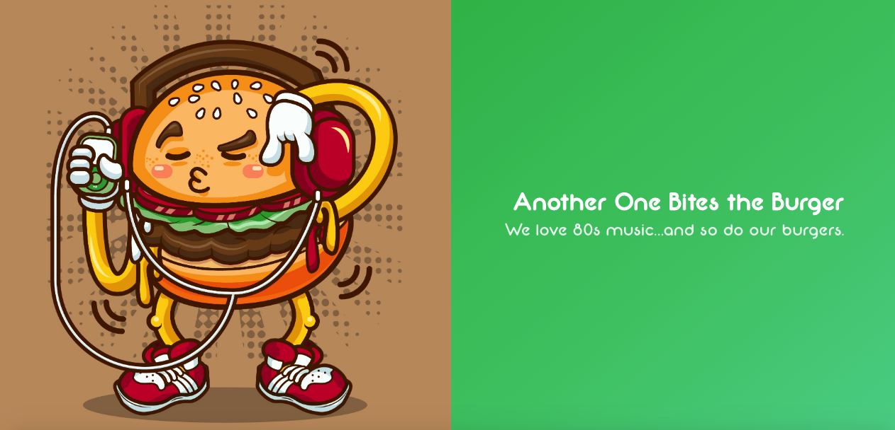

# Another One Bites the Burger

## Table of Contents
*  [Description](#description)
*  [User Story](#user-story)
*  [Features of the Application](#features-of-the-application)
*  [Preview of Another One Bites the Burger](#preview-of-another-one-bites-the-burger)
*  [Links](#links)
*  [Installation](#installation)
*  [Usage](#usage)
*  [Acknowledgments](#acknowledgments)
*  [Built Using](#built-using)
*  [License](#license)
*  [Contributing](#contributing)
*  [Questions](#questions)

## Description

Another One Bites the Burger is an 80's-themed musically punny burger logger application that allows the user to create a burger of their choice by inputting its name into the application. Once the user has created their burger, it will be displayed onto the page where their order will be available to be picked up. The user may then choose to create additional burgers, "devour" their ordered burger, or delete their devoured burgers. The 80's could arguably be labeled as THE best decade for music, so the inspirations for punny burger names (based on music titles) are endless!

Another One Bites the Burger uses the CRUD operations (**C**reate, **R**ead, **U**pdate, and **D**elete) to build its persistent storage capabilities. These operations allow the application to communicate with the MySQL database and create differing routes (with Express routing) to create, view, update the devoured "status", and delete the burgers from the application. The application also uses Handlebars to generate the HTML (which used the Bulma CSS framework) through nesting expressions.

## User Story
~~~
AS A user  
I WANT to be able to use a restaurant application
SO THAT I can create, "devour" (update), and delete burgers.
~~~

## Features of the Application
~~~
GIVEN a restaurant application that allows the user to input the names of the burger that they would like to eat  
WHEN I submit a burger name  
THEN the application will display the burger on the left side of the page.  
WHEN I click on the "devour" button (utensils) of any burger that is in the waiting area  
THEN the burger will move to the right side of the page.  
WHEN I click on the "delete" button (trash bin) of any devoured burger  
THEN the burger will be deleted from the page.  
~~~

## Preview of Another One Bites the Burger

The following animation demonstrates the complete application functionality:

## Links

1. [Deployed Application](https://another-one-bites-the-burger.herokuapp.com)

2. [Github Repository](https://github.com/rh9891/AnotherOneBitesTheBurger)

## Installation

The application requires the following dependencies and/or package managers:
~~~
$ npm install body-parser
~~~

~~~
$ npm install express
~~~

~~~
$ npm install express-handlebars
~~~

~~~
$ npm install mysql
~~~

The following dependency - though optional - can also be used as it automatically restarts the node application when file changes in the directory are detected. Saving it as a `devDependency` allows the user to run the application using Nodemon:

~~~
$ npm install nodemon --save-dev
~~~

## Usage

An example of usage when testing the application using Nodemon as it updates the webpage after every change it detects:
~~~
$ npm run dev
~~~

## Acknowledgments

A heartfelt thanks to Github user, David Cox, whose helpful video tutorial I looked to for guidance whenever I found myself stuck, especially when building the structure of the ORM variable and creating the routes - the right way! - for the POST and DELETE routes.

## Built Using

Listed below are the frameworks and guides that made building this burger application possible:

* [Bulma](https://bulma.io/documentation/)
* [Handlebars](https://handlebarsjs.com/guide/#what-is-handlebars)
* [Express Routing](https://expressjs.com/en/guide/routing.html)
* [Model View Controllers (MVC)](https://www.geeksforgeeks.org/mvc-design-pattern/)

## License

This application does not currently have any licenses.

The user is not permitted to use, modify, or share any parts of it. Though the code for this application is hosted on Github, where you are allowed to view and fork the code, this does not imply that the user is permitted to use, modify, or share the contents of this application for any purpose.

## Contributing

If you would like to contribute to this repository, please contact me via [Github](https://github.com/rh9891).

## Questions

If you have any questions, comments, or issues regarding this command line interface application, please do not hesitate to contact me through [Github](https://github.com/rh9891).